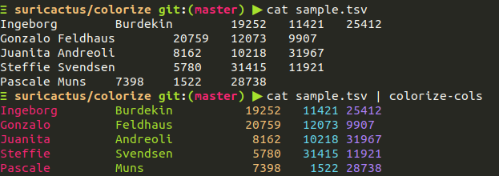

# colorize-cols

Convert a TSV to colored and well formated output for each column.


```
usage: colorize-cols [-h] [-s SEPARATORS] [-o OUTPUT_SEPARATOR] [file]

positional arguments:
  file                  File to be colorized. Default: STDIN

options:
  -h, --help            show this help message and exit
  -s SEPARATORS, --separators SEPARATORS
                        Separators delimited by a comma. Default: \t
  -o OUTPUT_SEPARATOR, --output-separator OUTPUT_SEPARATOR
                        Output separator. Default: \t
```

## Example

```
echo "something\telse\tother" | colorize-cols
```

## Screenshot


